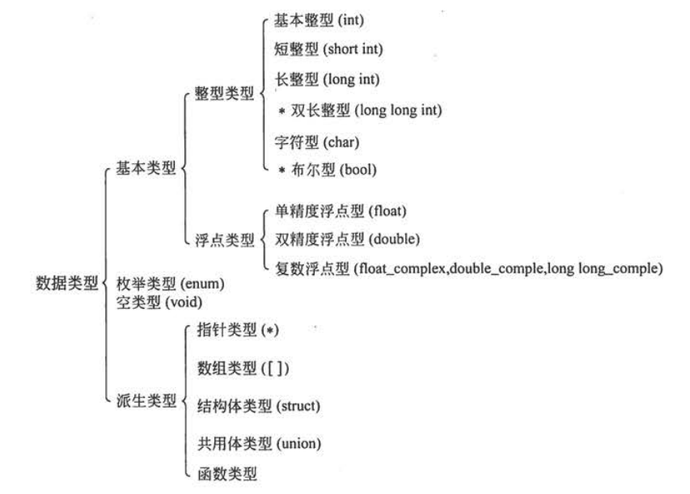

# C语言程序设计
## 数据类型


>基本类型和枚举类型变量的值都是数值，统称为算术类型。算术类型和指针类型统称为纯量类型，因为其变量的值是以数字来表示的。

>数组类型和结构体类型统称为组合类型，共用体类型不属于组合类型，因为在同一时间内只有一个成员具有值。函数类型用来定义函数，描述一个函数的接口，包括函数返回值的数据类型和参数的类型。

## 整型数据
### 整型数据的分类
#### 基本整型(int 型)
>数据存储方式：用整数的补码(二进制整数补码规则：正数的补码是自身，负数的补码是将其绝对值的各位按位取反再加1)形式存放，第一个二进制为代表符号(0-整数 1-负数)。假设占用空间为N字节，则表示范围为：-2^N ~ 2^N-1

>各类型占用空间如下：

|类型|占用空间|表示范围|
|----|----|----|
|int|2字节/4字节||
|short int|2字节||
|long int|8字节||
|long long int|8字节||

>占用空间规则：
$$sizeof(short)<=sizeof(int)<=sizeof(long)<=sizeof(long long)$$

>因为各个系统相同数据类型占用空间不同，所以在进行迁移时，需要注意。

>可以将只有正值的数据定义为无符号类型(<em>unsigned int,unsigned short等</em>)，为了充分利用变量数据类型的存储范围，可以将变量定义为无符号类型。只有整数数据存在无符号类型(可以使用unsigned修饰符修饰)，实型数据没有无符号数。

### 字符型数据
>字符是按其在字符集中的代码(整数)形式存储的，所以把字符型数据也作为整数类型的一种。

>ASCII 字符集使用一个字节表示所有字符，所有字符编码第一位均置0，后面7位作为编码存储位。如'a'的ASCII 代码是十进制数97，二进制形式为1100001，所以'a'在内存中表示为：01100001

>由于127个字符不够用，所以启用ASCII中置0的第一个二进制为，将字符集扩展为255个。

### 浮点型数据
>实数是以指数形式存放在存储单元中的。一个实数可以使用多种指数形式表示，将小数部分中小数点前的数字为0、小数点后第一位数字不为0的表示形式成为规范化的指数形式，一个实数只有一个规范化的指数形式，在程序以指数形式输出一个实数时，必然以规范化的指数形式输出。

#### float型
>单精度浮点型，占用空间4字节。数值以规范化的二进制指数形式存放在存储单元中。能得到6位有效数字。

>双精度浮点型，占用空间8字节。可得到15位有效数字。在C语言中进行浮点数的算数运算时，将float型都自动转换为double型，然后计算。

>长双精度。

### 常量类型
>整型常量：
    - 整数即为整型常量。但是也会根据其范围确定一个合适的类型。
    - 在一个整数末尾加上L/l,表示它是长整型。

>浮点型常量：
    - 凡以小数形式或指数形式出现的实数，是浮点型常量，在内存中以指数形式存储。系统默认把浮点型常量都按双精度处理。
    - 在常量末尾加上F/f,强制指定常量类型为单精度。
    - 在实型常量后加L/l,则常量为long double型。

### 运算符
>基本运算符：
- 两个实数相除的结果是双精度实数，两个整数相除的结果为整数。
- 如果除数或者被除数中有一个负值，则舍入方向根据系统的不同而不同。

>不同类型数据间的混合运算:若一个运算符两侧的数据类型不同，则会自动进行类型转换使二者具有同一数据类型，然后再进行运算。所以整型、实型、字符型数据间可以进行混合元素，规则为：
- +、-、*、/运算中有一个数为float或double类型，则结果是double型。
- 若int型与float型或double型进行运算，先把int型和float型转换为double型，然后进行计算，结果是double型。
- 字符型与int型计算同java.

>ASCII字符集中，同一字母，小写字符代码比大写字符代码大32.

>强制类型转换运算符:在强制类型转换时，得到一个所需类型的中间数据，而原来变量的类型不会发生变化。

>C运算符

|运算符|举例|
|-----|-----|
|算数运算符||
|关系运算符||
|逻辑运算符|! && || |
|位运算符|<< >> ~ | ^ &|
|赋值运算符|=及其扩展|
|条件运算符|?:|
|逗号运算符|,|
|指针运算符|* 和 &|
|求字节数运算符|sizeof|
|强制类型转换运算符|(类型)|
|成员运算符|. ->|
|下标运算符|[]|
|其他|函数调用运算符()|

### 赋值过程中的类型转换
- 如果赋值运算符两侧的类型不一致，但都是算术类型时，在赋值时要进行类型转换。转换规则如下：
  - 将浮点型数据(包括单、双精度)赋给整型变量时，先对浮点数取整，然后赋予整型变量。
  - 将整型数据赋给单、双精度变量时，数值不变，但以浮点数形式存储到变量中。
  - 将double型数据赋给float变量时，先将双精度转化为单精度，然后存储到float变量的4个字节中。双精度数值的大小不能超出float型变量的数值范围。
  - 将一个占字节多的整型数据赋给一个占字节少的整型变量或字符变量，只会将其低字节送到赋值的变量。
>总结：整型数据之间的赋值，按存储单元中的存储形式直接传送。实型数据之间以及整型与实型之间的赋值，先进行类型转换，然后再赋值。

>注：在不同数据类型之间进行赋值，如果数据出现失真，系统不会给出出错提示。

>一个表达中可以包含另一个表达式。所以赋值表达式可以出现在其他表达式之中。

>一般变量初始化不是在编译阶段完成的(只有在静态存储变量和外部变量的初始化时再编译阶段完成的)，而是在程序运行时执行本函数时赋予初始值的。

## 输入输出
>C语言本身不提供输入输出，输入输出操作是由C标准函数库中的函数来实现的。

>预处理指令的两种形式：
- #include <stdio.h>
>编译系统从存放C编译系统的子目录中去找所要包含的文件，此为标准方式。
- #include "c:\temp\test.h"
>编译系统先在用户的当前目录中寻找要包含的文件，如果未找到，则按标准方式查找。

>疑问：C编译系统在使用函数和变量前，需要首先定义函数。使用预处理指令引入头文件后，编译系统使用标准方式和非标准方式查找头文件引入到当前文件中；如果一个文件内引入了两个头文件，而这两个头文件内声明了两个完全一致的函数，在程序链接时，会使用哪个函数实现？这种情况是不是合法？


### printf函数
>格式字符：
- d 用于输出有符号十进制数
- c 用于输出一个字符串
- s 用于输出一个字符串
- f 用于输出实数(包括单、双、长双精度)
  - 基本型 %f 不指定输出数据长度，由系统自动决定数据所占列数，一般做法：实数中的整数部分全部输出，小数部分输出6位。
  - 指定数据宽度和小数位数 %m.nf——一共占m列，n位小数 小数部分采用四舍五入处理，小数位数指定需要注意实数有效位数(单精度6位，双精度15位)
  - 输出数据向左对齐 %-m.nf
- e格式符 %e 以指数形式输出实数，若不指定输出数据所占宽度和数字部分的小数位数，默认数字部分的小数位数为6位，指数部分占5列。
  - %m.ne格式 
- i格式符 作用域%d相同
- o格式符 以八进制整数形式输出，输出值不带符号。
- x 格式符 以十六进制数形式输出整数
- u 格式符 用于输出无符号型数据，以十进制整数形式输出
- g 格式符 用来输出浮点数，系统自动选用f格式或e格式输出，选择其中长度较短的输出。


### scanf函数
>在用%c格式声明输入字符时，空格字符和转义字符中的字符都作为有效字符输入。

>scanf()在读取输入缓冲区时没有限制读取字节数，所以VisualStudio推出了可以限制读取字节数的方法scanf_s().

>多个scanf连用时，会出现后一个scanf读取到前一次输入的回车符号，导致后续输入没有被scanf获取到，可以通过在两个scanf中间加入getchar()方法读取缓冲区的回车符的方式解决。

>在输入多个数字时，需要使用空格分隔。在输入多个字符时，可不用其他字符分隔。

>在输入数值时，遇到非数字时，认为该数据结束。

### 字符输入输出
>除使用printf和scanf输入和输出字符外，还可以用如下函数进行字符的输入和输出：
- putchar 输出一个字符
- getchar 从输入设备中获取一个字符

## 选择结构程序设计
>逻辑型变量：C99新增的数据类型。可以将关系运算和逻辑运算的结果存入一个逻辑型变量中。可在使用逻辑变量类型符_Bool 时引入头文件：stdbool.h

>C语言中三目运算符：表达式1 ? 表达式2 : 表达式3   执行过程：先计算表达式1的值，若表达式1的值为真(非0)，则计算表达式2的值作为结果；否则计算表达式3的值作为结果。

>switch 后括号内的表达式，其值类型应为整数类型(包括字符型)

>for循环：for(表达式1;表达式2;表达式3) 表达式1和表达式3可以是任意一个或者多个表达式；表达式2可以是关系表达式或逻辑表达式或者数值表达式或者字符表达式，只要其值为非0，循环体就会被执行。

>break continue 在多重嵌套循环的情况下，对当前循环有效。


## 数组
>C语言不允许对数组的大小作动态定义。但是如果在被调用函数(不包括主函数)中定义数组，其长度可以是变量或非常量表达式。如果指定数组为静态存储方式，则不能用“可变长数组”。

>C语言中，数组名代表该数组的起始地址。所以在scanf中若输入项是数组名，则不应再加&。

>若定义数值型数组时，制定了数组的长度并对其进行初始化，未指定初始化值的元素会被自动初始化为0；如果是指针型数组，则初始化为NULL,即为空指针。

>二维数组称为矩阵。C语言中，二维数组中元素排列的顺序是按行存放的，即在内存中先顺序存放第一行的元素，接着再存放第二行的元素。所以在逻辑上二维数组时矩阵，但是在内存中二维数组实际是一个线性序列。

### 字符型数组
>C语言中没有字符串，字符串时存放在字符型数组中的，将字符串作为字符数组来处理，字符串的实际长度与数组长度相等。C语言规定了一个字符串结束标志——'\0'.C系统在用字符数组存储字符串常量时会自动加一个'\0'作为结束符。

>字符串处理函数：
- puts 将一个字符串(以\0结尾的字符序列)输出到终端。
- gets 从终端输入一个字符串到字符数组，并得到一个函数值，该函数值是字符数组的起始地址。
- strcat 字符串连接函数 结果存放在字符串数组1中，函数返回值是字符数组1的地址。
- strcpy 将字符串数组2(也可以是字符串常量)复制到字符串数组1中去，<b>不能用赋值语句将一个字符串常量或字符数组直接给一个字符数组，只能使用strcpy函数将一个字符串复制到另一个字符数组中去。用赋值语句只能将一个字符赋给一个字符型变量或字符数组元素。</b>
- strncpy 将字符串2中前N个字符复制到字符数组1中去。
- strcmp 字符串比较函数——将两个字符串自左至右逐个字符比较(按ASCII码值大小比较)，直到出现不同的字符或遇到\0为止，返回值0-相等，正整数-字符串1>字符串2，负整数-字符串1<字符串2
- strlen 测试字符串长度(不包括\0)
- strlwr 转换为小写的函数
- strupr 转换为大写的函数

## 用函数实现模块化程序设计
>C语言中要求，在程序中用到的所有函数，必须先定义后使用。当被调用函数的实现在调用位置的后面时，需要在调用位置之前(函数开头或函数之前)对被调用函数进行声明。

>在调用函数过程中，系统会把实参的值传递给被调用函数的形参——形参从实参得到一个值，如果形参值发生变化，实参值不会发生改变。

>函数中可以不要return语句。如果return语句中返回值类型与函数类型不一致，则会自动发生类型转换，最终以函数类型为准。

>对于不返回值的函数，应当将其定义为void类型。

>C语言使用函数原型作函数声明。

### 数组作为函数参数
>数组作为函数参数：数组名可以作为实参和形参，传递的是数组第一个元素的地址；数组元素可以作为函数的实参，其用法与变量相同，向形参传递数组元素的值。

>数组元素只能用作实参，不能作为形参。

>用数组元素作实参时，向形参变量传递的是数组元素的值，而用数组名作函数实参时，向形参(数组名或指针变量)传递的是首元素的地址。在函数形参中指定数组大小无效，可不指定大小。在编译时把形参数组名处理为一个指针变量，用来接收一个地址。在函数调用过程中，实参和形参数组指向同一块内存区域，所以改变形参数组元素时，实参数组元素值也会发生改变。

>高维数组名可以作为函数的实参和形参，在被调用函数中对形参数组定义时可以指定每一维的大小，也可以省略第一维的大小说明，但是不能把第2维以及其他高维的大小说明省略(定义 int array[][] 不合法)。C语言编译系统不检查数组一维大小。

### 局部变量和全局变量
>在函数外定义的变量是全局变量，全局变量可以在本文件中其他所有函数内使用，它的有效范围为从定义变量的位置开始到本源文件结束。

>习惯：将全局变量名的第一个字母用大写表示。建议不在必要时不要使用全局变量，原因如下：
- 全局变量在程序的全部执行过程中都占用内存，而不仅在需要时才占用内存。
- 在函数内使用全局变量使函数通用性变低。
- 过多全局变量会降低程序的可读性和清晰性。

### 变量的存储方式和生存期
>变量的存储有两种不同的方式：静态存储方式和动态存储方式。静态存储方式是指在程序运行期间由系统分配固定的存储空间的方式，而动态存储方式则是在程序运行期间根据需要进行动态的分配存储空间的方式。

>供用户使用的存储空间可以分为三个部分：
- 程序区
- 静态存储区
- 动态存储区

数据分别存放在静态存储区和动态存储区中。全局变量全部存放在静态存储区中，在程序开始执行时给全局变量分配存储区(占用固定的存储单元而不是动态分配和释放)，程序执行完毕就释放。

>动态存储区存放以下数据：
- 函数形式参数 在调用函数时给形参分配存储空间
- 函数中定义的没有用关键字static声明的变量，即自动变量
- 函数调用时的现场保护和返回地址等

>动态存储区的数据动态分配和释放。

>每个变量和函数都有两个属性：数据类型和数据的存储类别。存储类别指数据在内存中的存储方式(动态存储和静态存储)。

>C语言存储类别如下：
- 自动的(auto)
>数据存储在动态存储区中，函数形参和函数内局部变量(包括复核语句内局部变量)都属于此类，用关键字auto作储存类别声明，auto可以省略，默认隐含指定为此类。
>自动变量在每次函数运行时都会初始化，若没有指定初始化值，则初值不确定。
- 静态的(static)
>静态局部变量：若需要函数中的局部变量的值在函数调用结束后继续保留原值，在函数下次调用时，该变量值仍然存在，就看指定局部变量为静态局部变量，用static声明。
>静态局部变量只在编译时初始化一次，若没有赋初值，则系统默认赋为0或'\0'.
>尽管局部静态量在函数调用结束后仍然存在，但是除了再次调用当前函数外其他函数无法使用它。
- 寄存器的(register)
>一般情况下,变量(静态存储方式和动态存储方式)的值是存放在内存中的。对一些频繁使用的变量，允许将局部变量值存放在CPU中的寄存器中，需要时直接从寄存器中取出参加运算而不必到内存中去取，以提高程序执行效率，这种变量称为寄存器变量，用关键字register声明。
- 外部的(extern)
>一般情况下，外部变量是在函数的外部定义的全局变量，它们存储在静态存储区中，它们的作用域是从变量的定义处开始到本程序文件的结尾，在此范围内，全局变量为各函数共用。

>在一个文件内扩展外部变量的作用域
>>若外部变量未在文件头部定义，则其有效的作用范围只限于定义处到文件结束。变量定义前的函数无法使用此外部变量。为了在变量定义前的函数中使用其后定义的外部变量，可以在此函数内使用extern对该变量作外部变量声明，表示把该外部变量的作用域扩展到此位置，然后就可以在此函数中使用此外部变量。

>将外部变量的作用域扩展到其他文件
>>若在多个文件中需要使用同一个变量，可在任一文件中定义外部变量，而在另一文件中用extern对此变量作“外部变量声明”。
>>>extern:在编译过程遇到extern时，先在本文件中找外部变量的定义，如果找到，就在本文件中扩展作用域；若找不到，就在连接时从其他文件中找外部变量的定义，如果找到就将作用域扩展到本文件。如果找不到，出错。

>将外部变量的作用域限制在本文件中
>>在定义外部变量时加static声明，则此外部变量只限于被本文件引用，而不能被其他文件引用。这种外部变量称为静态外部变量。使用此种方式可以避免多个文件间变量互相干扰，提高程序模块化、通用性。


### 变量的声明和定义
>函数声明和定义：
>>函数声明是对函数的标志符(变量、函数、结构体、共用体等)的属性进行声明，它是函数的原型，而函数定义时对函数功能的定义。

>变量声明和定义
>>声明：
- 定义性声明/定义 int a
- 引用性声明 extern a
一般把建立存储空间的声明称为定义，把不需要建立存储空间的声明称为声明。变量初始化只发生在定义时，而不是声明时。声明仅仅是用于扩展变量作用域。

### 内部函数和外部函数
>函数本质上是全局的，若不加声明，一个文件中的函数可以被本文件中其他函数调用，也可以被其他文件中的函数调用。根据函数能否被其他源文件调用，将函数分为内部函数和外部函数。

- 内部函数
>只能被本文件中其他函数调用的函数称为内部函数。在函数名和函数类型前加static即可。

- 外部函数
>若定义函数时再首部最左端加关键字extern，则此函数可供其他文件调用，称为外部函数。可以省略，函数默认是外部函数。


>函数原型：用函数原型能够把函数的作用域扩展到定义该函数的文件之外(不必使用extern).只要在使用该函数的每个文件中包含该函数的函数原型即可，函数原型告诉编译器该函数稍后会定义。

## 指针
>将指向变量单元的地址称为指针，通过它能找到以它为地址的内存单元。
- 直接访问 按变量名进行的访问
- 间接方式 将变量的地址存放在另一变量中，然后通过该变量来找到变量的地址，从而访问变量。

>一个变量的地址称为该变量的指针，如果有一个变量专门用来存放另一个变量的地址(指针)，则它被称为指针变量，指针变量的值就是地址。

>定义指针变量的一般形式为：
类型名 * pointerVariableName;
>>类型名：在定义指针变量时必须指定的"基类型"，用来指定此指针变量可以指向的变量的类型。之所以需要指定此类型，是因为在使用指针变量操作变量时，操作的数据类型不同，需要改变的内存范围不同，所以需要在定义时明确。一个指针变量只能指向同一个类型的变量。

>>\*表示此变量为指针变量

>>指针变量名为pointerVariableName,而不是\*pointerVariableName.

>>在使用指针变量时，\*pointerVariableName 表示通过指针变量操作指针变量所指向的变量，为\*pointerVariableName 赋值会改变指针变量所指向的变量值。pointerVariableName 表示指针变量，为pointerVariableName赋值，只改变指针变量的值——只改变指针变量所指向地址，而不会影响指针变量所指向变量的值。

```c
int i;
int * i_pointer = &i;
*i_pointer = 123;
printf("变量值为：%d \n",*i_pointer);
```
>两种运算：
- & 取地址运算符
- \* 指针运算符(间接访问运算符)，*p 代表指针变量p指向的对象

>为了避免C语言中“值传递”方式，使得对形参的改变在实参可见，可以将实参的指针变量作为函数入参，在函数内部改变指针变量所指向的变量值，就可以达到改变实参所指向的变量值的目的；但是要注意，通过修改形参的值——指针变量的值(地址)是无法改变实参的值的。

### 指针引用数组
>引用数组元素可以使用下标法(a[0])，也可以使用指针法，即通过指向数组元素的指针找到所需的元素。使用指针法能使目标程序占内存少，运行速度快。
```c
int a [] = {1,2,3};
	int* p1 = &a[0],*p2=a,*p3=&a; //经测试，三种方式都可以把数组首元素地址赋给指针变量
	printf("指针p1:%d, p2:%d, p3:%d",p1,p2,p3);
	for (int i = 0; i < 3;i++) {
		printf("数组第%d个元素：%d \n",i,*p1);
		p1 ++;//地址从数组首元素地址偏移，获取其他元素,仅加1即可，毋须写成 p1 += sizeof(int); 指针会自动根据数据类型计算偏移量。
	}
	printf("另一种获取元素的方式：%d \n",*(a+2));
	printf("指向同一数组内元素的指针可以做求差值运算：%d \n",p1-p2);
```
>在指针指向数组元素时，允许对指针进行以下计算：
- 加一个整数 指针指向数组下一个元素
- 减一个整数 指针指向数组上一个元素
- 自加(减)运算
- 两个指针相减(两个指针都指向同一数组中的元素时才有意义)

>遍历数组的三种方法：
- 下标法 a[i]
- 通过数组名计算数组元素地址，获取元素值 *(a+i)
- 用指针变量指向数组元素 *p;p++;

>>第一种方式和第二种方式执行效率相同，编译系统是将a[i]转换为*(a+i)处理的；第三种方法较前两种快，不必每次重新计算地址。

>>指向数组的指针变量也可以使用 p[i]的方式获取数组元素。在编译时，会将p[i]处理成*(p+i)

>用数组名作为函数参数：如果形参数组中各元素的值发生变化，实参数组元素的值也随之变化。原因:实参数组名代表该数组首个元素的地址，而形参用于接收实参传递的数组首个元素地址。C编译将形参数组名作为指针变量来处理。
```
fun(int arr[],intn) => fun(int * arr,int n)
```
>实参数组名代表一个固定的地址，或者说是指针常量；但形参数组名并不是一个固定的地址，而是按指针变量处理。
#### 通过指针引用多维数组
>对多维数组：int a[m][n],a[0]代表一维数组中第0列元素的地址，即&a[0][0]。也就是说a[1]的值是&a[1][0],a[2]的值是&a[2][0]
- \*(a[i]+j)或*(*(a+i)+j) <=> a[i][j]
- *(a+i)和a[i]等价

>a[i]说明：
- 若a是一维数组，则a[i]代表a数组序号为i的元素的存储单元，它是有物理地址的，占存储单元。
- 若a是二维数组，则a[i]是一维数组名，它是一个地址，并不代表某一元素值，是一个指针常量。a[i]+j表示二维数组第i行第j个元素的地址。

>a+1 与 *(a+1)的值相等，都是a[1]的地址

>多维数组 a 是行指针 a[i] 是列指针；行指针+1跳过一行；列指针+1跳过一个元素。在指向行的指针前加*,就转换为指向列的指针。在指向列的指针前面加上&，就称为指向行的指针。

>一维数组 a 是列指针。

>在逻辑上，多维数组分布式一个矩阵。但是在内存中，多维数组的存储是一维线性的，整个数组占用一块连续的内存。二维数组按行排列。

>用指向数组的指针作函数参数：一维数组名可以作为函数参数，多维数组名也可以作函数参数。用指针变量作形参，以接受实参数组名传递来的地址。可以有两种方法：
- 用指向变量的指针变量
- 用指向一维数组的指针变量


### 指针引用字符串
>C语言中，字符串时存放在字符数组中的。引用字符串的方法有以下两种：
- 用字符数组存放一个字符串，可通过数组名和下标引用字符串中的一个字符，也可通过数组名和格式声明“%s”输出该字符串。
- 用字符指针变量指向一个字符串常量，通过字符指针变量引用字符串常量。

>C语言中只有字符变量，没有字符串变量。

>以上两种存储字符串的方式比较：
- 字符数组由若干个元素组成，每个元素中放一个字符，而字符指针变量中存放的是地址(第一个字符地址)。
- 赋值方式：可以对字符指针变量赋值，但不能对数组名赋值。
- 指针变量的值是可以改变的，而数组名代表一个固定的值(数组首个元素的地址)，不能改变，它只能在初始化时赋值。

>字符指针作函数参数：
- 传递字符数组名
- 传递字符指针变量
  
### 指向函数的指针
>编译时编译系统为函数代码分配一段存储空间，这段存储空间的起始地址(又称入口地址)称为这个函数的指针。
```
int(*p)(int,int) //函数指针
```

>调用函数的方法：
- 通过函数名调用  test(1,2);
- 通过函数指针变量调用 

>定义指向函数的指针变量的一般形式：
```
int(*p)(int,int);
```
#### 用指向函数的指针作函数参数
>可用于编写通用函数

### 返回指针值的函数
>定义返回指针值的函数的一般形式为：
```
类型名 * 函数名(参数列表)
```

### 指针数组和多重指针
>一个数组，若其元素均为指针类型数据，称为指针数组。定义一维指针数组的一般形式为：
```
类型名 * 数组名 [数组长度]
```
>注:不要写成 int (*p)[4],这是指向一维数组的指针变量

>> 指针数组比较适合用来指向若干个字符串，使字符串处理更灵活。

#### 多重指针
>定义一个指向指针数据的指针变量：
```
char ** p;
```

#### 指针数组作main函数的形参
>指针数组的一个重要应用时作为main函数的形参。main函数的形式如下：
- int main()
- int main(void)
- int main(int argc,char * argv[]) argc和argv是程序的"命令行参数"，argc(argument count) 指参数个数，argv(argument vector)是参数向量,它是一个*char指针数组，数组中每个元素指向命令行中的一个字符串

>命令行的一般形式为：
```
命令名 参数1 参数2 ······ 参数n
```

### 动态内存分配与指向它的指针变量
>全局变量分配在内存中的静态存储区，非静态的局部变量分配在内存中的动态存储区，这个存储区时一个称为栈的区域。除此以外，C还允许建立内存动态分配区域，以存放临时数据，这些空间随时开辟随时释放。这些数据临时存放在堆区，只能用指针来引用。

>对内存动态分配通过系统提供的库函数来实现，主要有以下四个函数：
- malloc
函数原型：
```
void * malloc(unsigned int size);
```
>作用：在内存的动态存储区中分配一个长度为size的连续空间，函数返回值是所分配区域的第一个字节的地址。
- calloc
函数原型：
```
void * calloc(unsigned n,unsigned size)
```
>作用：在内存的动态存储区中分配n个长度为size的连续空间，用于保存数组。函数返回指向所分配区域的起始位置的指针。
- free
函数原型：
```
void free(void * p);
```
>作用：释放指针变量p所指向的动态空间。
- realloc
函数原型：
```
void * realloc(void *p,unsigned int size);
```
>如果已经通过malloc函数或colloc函数获得了动态空间，向改变其大小，可以用recalloc函数重新分配。

>注：以上四个函数的声明在stdlib.h头文件中。

#### void指针类型
>指向空类型或不指向确定类型的数据。在将它的值赋给另一指针变量时由系统对他进行类型转换，使之适合于被赋值的变量的类型。


### 指针总结
- 指针就是地址，指针变量的值是一个地址。
- 指向：地址就意味着指向。
- 对数组的操作中正确使用指针。
- 指针运算
- 指针变量可以有空值，即该指针变量不指向任何变量：p = NULL;//NULL是一个符号常量，代表整数0,定义在stdio.h头文件中。

## 自定义数据类型
>在对结构体变量中的成员进行局部初始化时，其他未执行初始化的数值型成员被系统初始化为0，字符型成员被初始化为'\0',指针型成员被系统初始化为NULL。

>结构体数组

### 结构体指针
>结构体指针是指向结构体变量的指针。结构体指针既可以指向结构体变量，也可以指向结构体数组中的元素。指针变量的基类型必须与结构体变量的类型相同。

>结构体指针使用：
```
stu.p <=> (*p).name <=> p -> name
```
<em>-></em> 称为指向运算符

>将一个结构体变量的值传递给另一个函数时，通常采用的方式就是将指向结构体变量(或数组元素)的指针作实参，将结构体变量(或数组元素)的地址传给形参。

### 指针处理链表

### 共用体类型
>使几个不同的变量共享一段内存的结构，称为共用体类型的结构。共用体类型变量的一般形式为：
```
union 共用体名
{
    成员表列
}变量表列;
```
>共用体所占内存空间为共用体类占用内存空间最大的数据类型决定。而不是各个成员所占内存空间之和。

>不能引用共用体，而只能引用共用体变量中的成员。

>使用共用体注意事项：
- 虽然共用体可以存储多种数据类型，但是在同一时刻，共用体变量只能存储一个值。
- 可以使用一个常量对共用体进行初始化。

### 枚举类型
>把可能的值一一列举出来，变量的值仅限于列举出来的值的范围内，这种类型称为枚举类型。

### typedef
>除了可以用C提供的标准类型名(int,char,float,double,long等)和结构体、共用体、枚举类型外，还可以用typedef指定新的类型名来替代已有类型名：
- 使用一个新的类型名代替原有类型名
```
typedef int Integer; //指定用Integer作为类型名，与int相同
typedef float Real; //指定用Real为类型名，作用与float相同
Integer i = 4;
Read j = 1.2;
```
- 命名一个简单的类型名代替复杂的类型表示方法
>结构体类型、共用体类型、枚举类型、指针类型、数组类型等形式复杂，可以使用简单的类型名替代：
```
typedef struct {
    int month;
    int day;
    int year;
} Date;
Date birthday; // 替代后写法
Date * p; //替代后写法
```
- 命名一个新的类型名代表指针类型
```
typedef char * String;
String p,s[10];
```
- 命令一个新的类型名代表指向函数的指针类型
```
typedef int(* Pointer)();
Pointer p1,p2;
```
>按定义变量的方式，把变量名换上新类型名，并且在最前面加typedef,就声明了新类型名代表原来的类型。

>习惯上常把typedef声明的类型名的第一个字母大写。

>typedef 与 #define 比较：
- #define在预编译时做源文件字符串替换处理
- typedef是在编译阶段处理的
- 使用typedef有利于程序的通用与移植

## 对文件的输入和输出
### 文件基本知识
- 文件分类
- 文件类型
- 文件缓冲区
- 文件类型指针
- 文件信息区

### 打开与关闭文件
- fopen 函数打开数据文件(创建文件信息区和缓冲区)
```
fopen(文件名,使用文件方式);
```

>计算机从ASCII文件读入字符时，遇到回车符，系统把它转换为一个换行符，在输出时把换行符转换成回车和换行符两个字符。在用二级制文件时，不进行这种转换，在内存中的数据形式与输出到外部文件中的数据形式完全一致。

>程序中可使用3个标准的流文件——标准输入流、标准输出流、标准出错输出流。程序开始运行时系统自动打开这三个标准流文件。系统定义了三个文件指针stdin,stdout和stderr分别指向标准输入流，标准输出流和标准出错输出流。

- fclose 函数关闭数据文件(撤销文件信息区和文件缓冲区，使文件指针变量不再指向文件)

- fgetc
- fputc
- fgets
- fputs
- fprintf
- fscanf
- fread
- fwrite
- rewind 函数使文件位置标记指向文件开头
- fseek函数改变文件位置标记
- ftell 函数测试文件位置标记的当前位置
- ferror函数检测输入输出函数调用时异常
- clearerr函数使文件错误标识和文件结束标识置为0